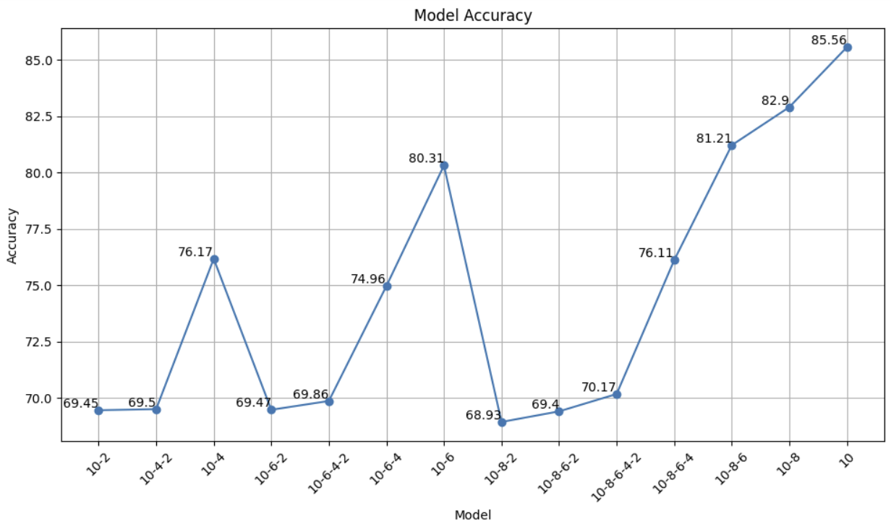

### Experimental setup in paper

1. cifar-10 dataset을 사용하였다.
2. 데이터 전처리로 각 이미지의 평균을 0, 표준 편차를 0.5로 통일하였다.
3. stochastic 경사 하강법을 사용하였다.
4. momentum 값은 0.9, learning rate는 0.1, epochs은 150으로 하였다. 이 때, model을 resnet을 사용하는 경우에는 epochs을 80에서 0.01로 감쇠, 120에서 0.001로 조절하였다.
5. cnn model을 사용할 경우, convolution은 batch normalization과 maxpool을 같이 사용하였다.

### My experimental setup

논문과 마찬가지로 cifar-10 dataset을 사용하였다. 이미지의 평균을 0, 표준 편차를 0.5로 통일하였다. SGD 최적화를 사용하였고, momentum 값도 0.9로 맞추었다.

나는, TAKD가 정말 잘 작동하는지, 이미 밝혀진 논문을 토대로 구현을 해보는 학습으로 cnn 모델만 사용하였다.

논문에서는 epochs을 150으로 하고 lr을 0.1로 설정하였다. 그리고 cnn model의 경우 감쇠를 하지 않고, 0.1을 그대로 유지시킨다. 하지만 0.1로 하니 빠르게  local minimum에 잘 도달하지 못하는 것 같아 보였고, 0.01로 수정하여 모델을 훈련시켰다. epochs도 마찬가지로 이미 20번째 반복이 되었을 때, local minimum에 근접하였고, 이후로는 근처에서 진동하는 수렴 형태를 띄었다. 완벽한 성능 측정이 목표가 아니기에, epoch을 100으로 줄여 local minimum 부근에 잘 도착한 지만 측정해보았다.

논문에서 사용한 cnn 모델 그대로 github 링크를 통해 가져와서 진행하였다.

teacher와 student를 연관 지어 학습한 후 student 모델을 saved 폴더 아래에 저장하였다. 

또한 각 모델에 대한 평가표를 그래프로 시각화하여 나타내었다.

미묘한 차이긴 하나 layer 10 모델에서 layer 2 모델로 바로 지식 증류를 하는 것 보다, TA를 통해 중간 학습 단계를 거치고 난 후 layer 2로 지식 증류를 하는 것이 더 나은 성능을 보여주고 있다.

논문대로 라면, 10-8-6-4-2가 제일 높은 성능을 내야 맞지만, 위의 실험 결과를 자세히 보면, 10-6-4-2가 더 높은 성능을 낼 수 있음을 알 수 있다. 그리고 전체적으로 layer 10에서 layer 8로 지식 증류를 거친 모델보다 layer 8을 거치지 않고, layer 6을 거친 모델이 더 나은 성능을 보여주는 듯 하다. 

layer 10에서 layer 8로 지식 증류가 이루어질 때, 약간의 오류가 섞여서 증류가 되었을 것이라고 추측하고 이것은 layer 6, 4를 거치면서 잘못된 지식이 계속되어 증류가 되었을 것이다. 

이러한 현상을 눈사태 현상이라고 하고, 이 단점을 개선한 모델이 GDKD이다. 

중간에 거치는 모든 TA들을 개별 teacher로 놓고 지식 증류를 진행하는 multi-teacher ensemble 모델이다.